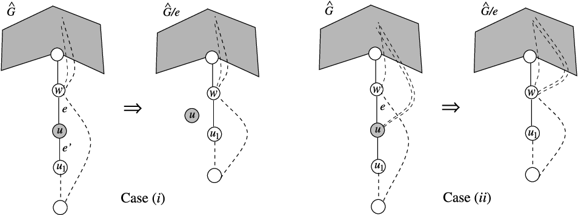

# 一些基础的定义

注意，我们默认图是连通的，且没有自环（可能有重边）。

- **桥**（bridge）是指删掉之后会使图不连通的边。
- **边双连通**（2-edge-connected）是指图中没有桥。
- **割边对**（cut-pair）是指删掉之后会使图不连通的**两条边**（组成的二元组），且这两条边都不是桥。
- **割边**（cut-edge）是指割边对中的边。（注意，和常见的定义不同）
- **边三连通**（3-edge-connected）是指图中没有桥和割边对。
- **边三连通分量**（3-edge-connected component）是指极大边三连通子图。
- $\operatorname{dfs}(w)$ 代表 $w$ 的 DFS 序。
- 对于一条边 $e=(u,v)$：
	- 如果 $\operatorname{dfs}(u)<\operatorname{dfs}(v)$，那么它是一条 **树边**（tree-edge），记做 $u\to v$。此时 $u$ 是 $v$ 的父亲，$v$ 是 $u$ 的儿子。
	- 如果 $\operatorname{dfs}(u)>\operatorname{dfs}(v)$，那么它是一条 **返祖边**（back-edge），记做 $u\hookrightarrow v$。此时 $u$ 是 $v$ 的后代，$v$ 是 $u$ 的祖先。这条边是 $v$ 的**传入返祖边**（incoming），是 $u$ 的**传出返祖边**（back-edge）。
- $G$ 中所有的树边形成了一棵生成树，记做 $T$（即 DFS 树）。
	这里是一些 DFS 树的性质：
	- $T$ 的根是 $r$。
	- $u$ 是 $v$ 的祖先（$v$ 是 $u$ 的后代），当且仅当 $u$ 在路径 $r-v$ 上。
	- $u-v$ 是一条**树上路径**（tree-path）当且仅当 $u$ 是 $v$ 的祖先。
	- $T_w$ 是 $T$ 中以 $w$ 为根的**子树**。
	- 对于一个点 $w$，定义 $\operatorname{lowpt}(w)=\operatorname{dfs}(z)$，其中 $\operatorname{z}$ 是所有的，可以通过一条**树上路径** $w-z$ 和一条**返祖边** $v\hookrightarrow z$ 到达的点中，DFS 序最小的。（就是 `low[]` 的定义）

# 简化过的实现方式

首先，我们简要的解释一下 [17] 中的核心思想。

从输入的图 $G=(V,E)$ 开始，逐渐对图进行变换，最后将属于同一个边三连通分量的所有点缩成一个点，称为**超顶点**。每一个超顶点被表示为一个点 $v\in V$ 和一个集合 $\sigma(v)$，这个集合包含所有已经确认和 $v$ 在同一个边三连通分量的点。

最开始，每个点 $v$ 被视为一个只包含自身的超顶点，即 $\sigma(v)=\{v\}$。当两个超顶点 $w,u$ 合并时，其中一个，例如 $w$，把另外一个点对应的集合「吸收」，得到 $\sigma(w)\gets\sigma(w)\cup\sigma(u)$。

一旦形成了一个包含整个边三连通分量的超顶点，它将会被从图中割开，成为一个孤立的超顶点。在最后，原图将会被变换为一堆孤立点，其中每个孤立点包含了 $G$ 中的一个边三连通分量。

图通过**吸收-弹出操作**（absorb-eject operation）进行变换。设：在对 $e=(w,u)$ 进行操作时，图 $G$ 被变换成了 $\hat G$：

- 如果 $\operatorname{deg}_{\hat G}(u)=2$，令 $e'=(u,u_1)$ 为另外一条和 $u$ 相连的边，那么 $(e,e')$ 是一个割边对。所以 $e$ 和 $e'$ 被替换成了一条新边 $(w,u_1)$，同时 $u$ 成为了一个孤立超顶点。（Case (i)）
- 如果 $\operatorname{deg}_{\hat G}(u)\ne2$ 且 $e$ 已经被确认不可能是割边了，

为了进行转换，这个算法会从 $G$ 中任意一个点 $r$ 开始 DFS。在 DFS 的过程中，每当从某个点 $u$ 回溯到某个点 $w$ 时，$T_u$ 的顶点构成的导出子图会被转换为一些孤立超顶点，和一条 $u-u_1-u_2-\cdots-u_k$ 的树上路径。

